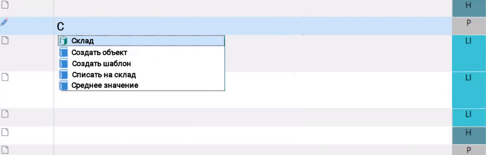
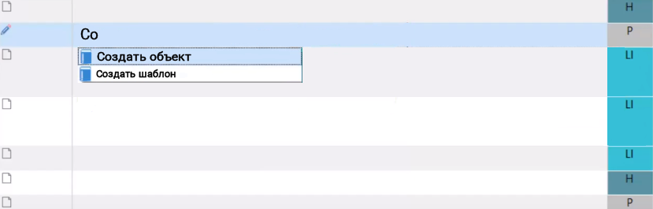

AutoSuggest technology
=======================

In contrast to the translation memory, which stores entire segments, Auto-Suggest technology is based on incomplete segments - words or phrases. The principle of AutoSuggest is similar to that of AutoComplete in Microsoft Word - suitable words/phrases are suggested automatically when translating text in SDL Trados Studio.

For example, if you enter the letter C, the system (depending on the con-text of the source text) tries to guess which word or phrase you are trying to translate and offers the Create object segment as a translation option. If the AutoSuggest dictionary contains several matching segments, all seg-ments are shown. By clicking on the corresponding entry you can copy it into your translation.

Fragments from the AutoSuggest Dictionary can be recognized by the blue book icon in front of the fragment. The green icon is used for terms found in the terminology database. As you type the following letters, the list of frag-ments is updated accordingly, offering only matching fragments.

Words and phrases in AutoSuggest can be taken from several sources:

- **Lists with auto-text**. You can create your own lists containing specific words and phrases. These words and phrases are automatically suggested when you translate texts.
- **AutoSuggest Dictionaries**. AutoSuggest dictionaries contain words and phrases retrieved from the translation memory. A special module in SDL Trados Studio analyzes the translation memory, finds the appropriate words and phrases, and adds them to the AutoSuggest dictionary. See al-so the information about the SDL AutoSuggest Creator module below.
- Instances of translation memories and machine translation systems con-figured for use with your project.
- SDL MultiTerm terminology bases.
- Fragment matches from translation memory instances that support frag-ment alignment.

SDL AutoSuggest Creator
------------------------

If you are using SDL Trados Studio Freelance or SDL Trados Studio Free-lance Plus version, you need to buy an additional module - SDL AutoSuggest Creator to be able to create AutoSuggest dictionaries. SDL Trados Studio Professional Edition owners do not need an additional module - the ability to create AutoSuggest dictionaries is built into this version.

