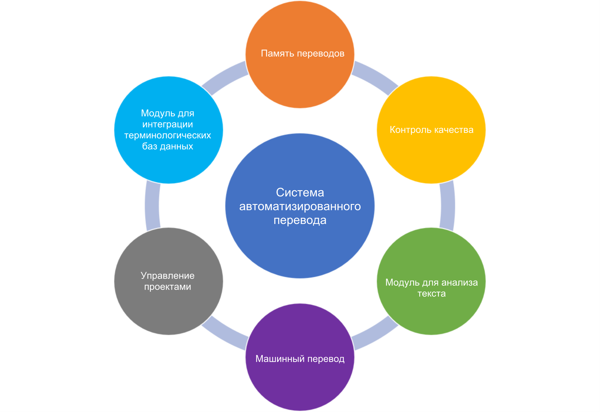

Overview of automatic translation systems
==========================================

Computer-assisted translation tools (CAT tools) are used to translate texts from one language to another more quickly and efficiently. These systems are based on a translation memory, which stores the source text and its translated equivalent. When a new text is translated, the translation memory is checked for identical or similar text fragments and is offered to the trans-lator for further use. The translator can use the text unchanged or modify it at his/her own discretion.

In addition to the translation memory that stores the source text and its translated equivalent, automated translation systems typically have the fol-lowing features built in:

- Editor for text translation and editing
- Module for terminology database integration
- Translation quality control tools (e.g., spelling and grammar check)
- Module for word count and analysis of translated text
- A module for comparing source and translated texts and creating a trans-lation memory based on them
- Modules / filters for data exchange with other programs (Microsoft Office, XML, etc.)
- Machine translation connectivity tools
- Module for project management

We will look at most of these functions in detail in the next lessons.

Benefits
---------

Automated translation systems offer a number of advantages over manual translation:

- Reduce translation time and costs (up to 40-50%).
- Ensure consistency of style and terminology through the use of translation and terminology databases.
- Improve the quality of translations.