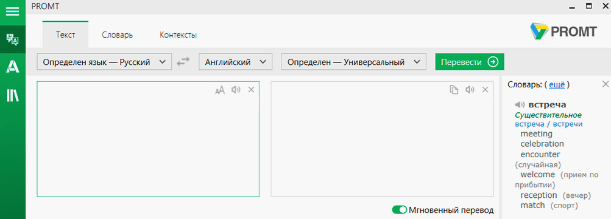

Difference between CATs and machine translation
================================================

Sometimes the terms "automated translation systems" and "machine trans-lation systems" are used synonymously. However, in fact, this is not the case. Let's try to find out how these systems differ from each other.

Automated translation systems
------------------------------

Automated translation systems are controlled by a human (translator), help-ing him to translate the source text, using the existing translation memory, terminology database, quality control tools, etc. That is, the systems only help the translator to translate, and do not do it for him. One such automat-ed translation system is SDL Trados Studio, which we will get to know later.

Machine translation systems
----------------------------

Machine translation systems are specialized computer programs that fully translate texts from one natural language to another without the interven-tion of a translator. An example of such a system is, for example, the ma-chine translation system from the company PROMPT.

The main advantages of machine translation systems are quick access to the system, high translation speed and low cost. The main disadvantage of such systems is that the quality of translations is not always high. As a rule, text translated by machine translation requires additional revisions.