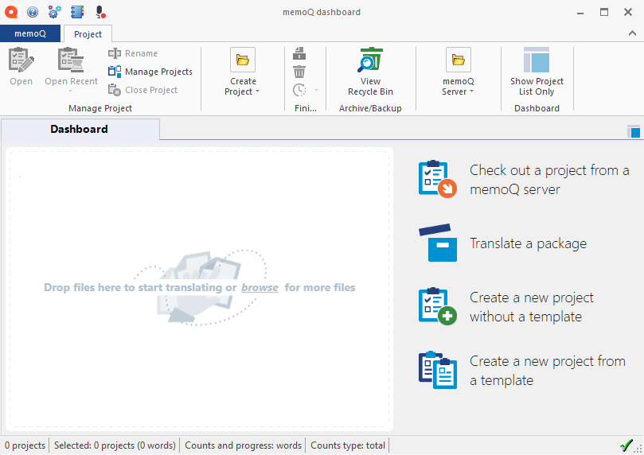
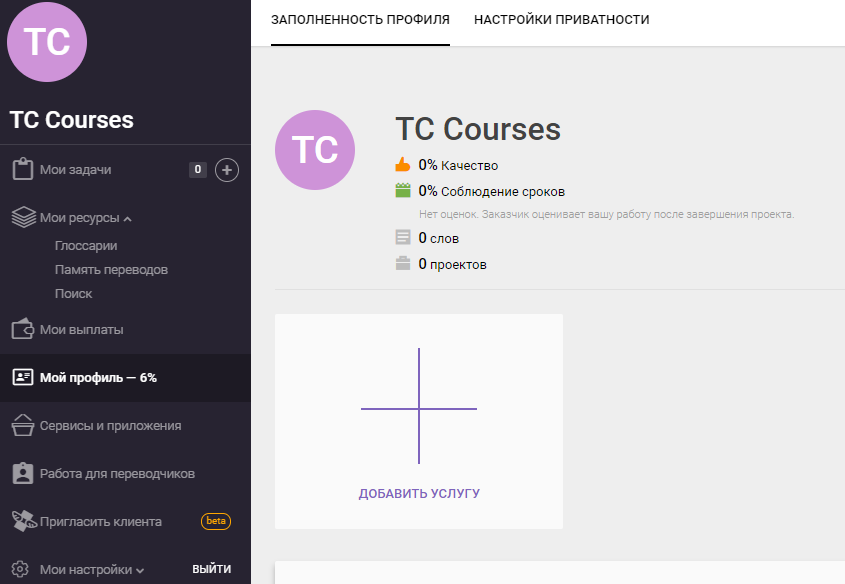

A brief look back in history
=============================

The beginnings of automated translation systems date back to the 1950s, when the need arose to translate large volumes of text. Technology was ad-vancing at a rapid pace, and the productivity of translators was no longer up to the demands. Therefore, some companies tried to find a way to increase the productivity of translators by using various computer technologies. Par-ticular attention was paid to reusing already translated texts.

In spite of this, it was not until the 1990s when the German company TRA-DOS GmbH released the first version of its system, Translator's Workbench, that automated translation systems gained an active development. In the second half of the 1990s and early 2000s, a large number of other compa-nies emerged on the market, offering their own solutions in the field of au-tomated translation.

The following companies are currently the strongest players on the auto-mated translation market:

- SDL Trados Studio
- Across
- Transit
- memoQ
- Wordbee

In addition, cloud solutions are gaining popularity:

- SDL Studio GroupShare Cloud
- Smartcat
- Memsource
- HTM

Typically, cloud solutions include a translation memory, a machine transla-tion module, a terminology database management module, and collabora-tive features for translators working on a single document. In this case, all linguistic resources (translation databases, terminology databases, etc.) are stored in the cloud (on a web server), and the necessary infrastructure (hardware and software) is rented.