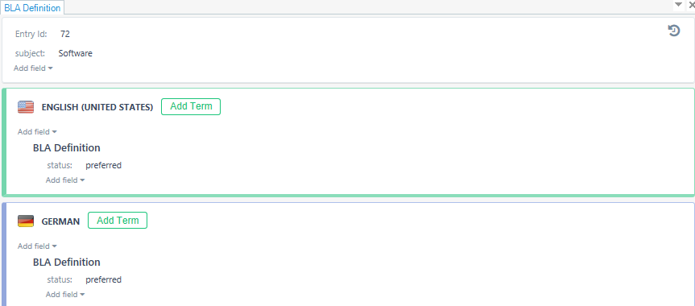

Terminology databases
======================

Typically, automatic translation systems work in conjunction with other ap-plications, especially terminology management systems (also called termi-nology systems). Terminology management systems create terminology da-tabases (bilingual dictionaries) that contain translations of words or small phrases. During the translation process, automatic translation systems check the connected terminology database and show the translation of those terms that appear in the current segment.

In addition to the terms themselves, terminology databases contain various linguistic information (gender, part of speech, case, number, etc.) and me-ta-information (scope, source, etc.). For some terms, synonyms and exam-ples of use in a certain context can also be provided.

The following are some of the benefits of using terminology databases (sin-gle terminology):

- Improving translation quality
- Reduced text translation costs
- Recognizing "forbidden terms"
- Better perception of translated texts and, as a result, greater customer satisfaction