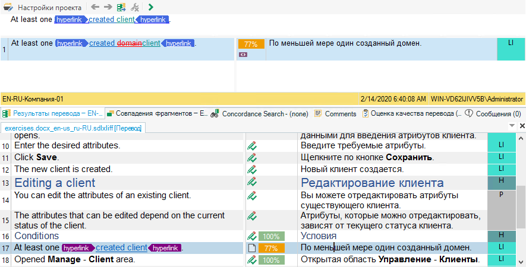
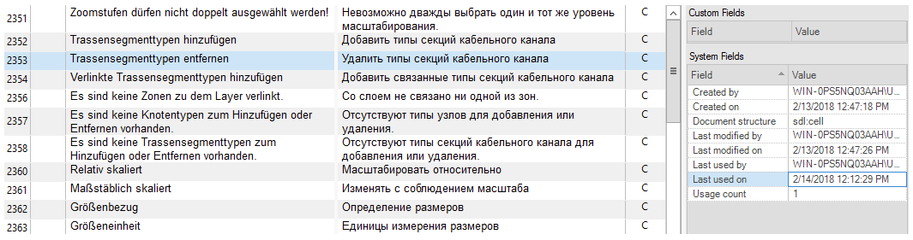

Translation memory
===================

Most automated translation systems are based on a translation memory. A translation memory is a special database storing the source text and its translated equivalent. When new texts are translated, the databases are checked for identical or similar fragments:

- If such fragments are found, they are shown to the translator, who can use them without changes or make necessary corrections. The edited fragment is also saved in the translation memory and can be used later when translating new texts.
- If the system does not find similar fragments, you can enter the transla-tion for the new fragment by yourself. After the fragment is translated, it is also saved in the database and the system moves on to translate the next fragment.

Typically, translation memories are stored as separate files that can be con-nected to automated translation systems. Some systems allow you to work with several files simultaneously (for example, SDL Trados Studio). In this case, one memory can be used as the main one, and the rest can be used for reference information.

The advantage of automatic translation systems is most clearly seen in the case of updating already translated documents. In this case, all fragments which have not changed since the last translation are translated automatical-ly, and the translation of similar, previously translated sentences is displayed for the changed fragments.

As a rule, texts are stored in the database in the form of so-called seg-ments. A segment can be any piece of text: a whole sentence, a header, list items, etc. Along with translated segments, the database usually stores addi-tional information about the segments: creation date, last modified date, translator's name, etc.

