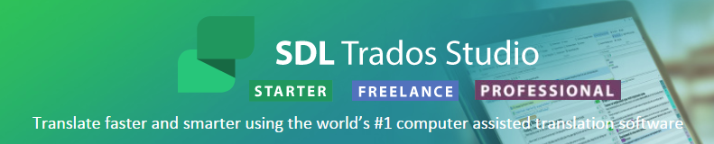
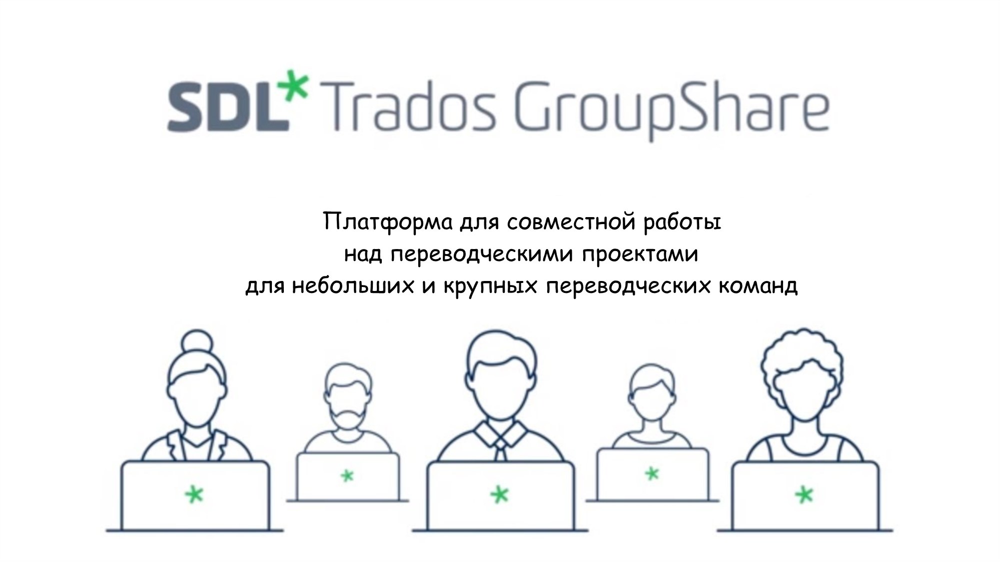

Installation and first run
===========================

SDL Trados Studio from the British company SDL International is one of the most well-known automatic translation systems. The first version of the pro-gram was developed by the German company Trados GmbH, which was bought by SDL International in 2005. At the heart of the program is a special database - a translation memory, containing a bilingual corpus of texts from the source and target languages. Today there are three main versions of SDL Trados Studio on the market:

- SDL Trados Studio Freelance
- SDL Trados Studio Starter
- SDL Trados Studio Professional

SDL Trados Studio Freelance and SDL Trados Studio Starter
----------------------------------------------------------

The first two versions - SDL Trados Studio Starter and SDL Trados Studio Freelance - are intended for freelancers and small companies that work with small amounts of translation or with a limited set of languages. They support five languages that are selected during the installation of the program. The main differences between the two versions are listed below:

- With SDL Trados Studio Freelance, you buy a perpetual license, but with SDL Trados Studio Starter, you buy an annual subscription with an option to renew it for another year. Please note that a perpetual license gives you the right to receive free updates only for the current major version of the program (for example, updates for SDL Trados Studio 2017). To upgrade your system to an older version (for example, SDL Trados Studio 2019), you must buy an upgrade package.
- The maximum number of translation units in translation memory for SDL Trados Studio Starter (when translating a file) is limited to 5000.
- Only one translation memory can be connected to SDL Trados Studio Starter.
- The SDL Trados Studio Starter subscription does not include the SDL MultiTerm terminology management system.

In both versions - SDL Trados Studio Starter and SDL Trados Studio Free-lance - there is a limit on the number of languages supported - 5 languages. The selection of languages is done during the installation of the program. Each language option (for example, American English) is treated as a sepa-rate language. Once the installation is complete, the selected languages cannot be changed. To change the languages you will need to deactivate your current license, uninstall the program from your computer and then install it again.

Both versions do not support creating AutoSuggest dictionaries, although you can use existing dictionaries without any restrictions. You can purchase a separate license to create AutoSuggest dictionaries.

SDL Trados Studio Professional
-------------------------------

The main difference between SDL Trados Studio Professional and the above-mentioned versions is the absence of language restrictions and the large number of tools required for translation, editing, project management, and working with terminology.

SDL Trados GroupShare
----------------------

A separate place is occupied by SDL Trados GroupShare, a solution designed for collaborative work on translation projects. Using this solution, translators and project managers can easily and securely share project files, terminolo-gy, and translation databases in real time. You can use the Workgroup version of SDL Trados GroupShare to work in a system environment.

So what to choose?
-------------------

For most self-employed translators, SDL Trados Studio Freelance is the best choice because it is more affordable and has all the functionality needed to perform translation tasks. SDL Trados Studio Starter may be suitable for those who occasionally need to translate small text files, while the professional version is intended for small and large companies for which translation projects are also important.

So, if you are a self-employed translator and do not plan to work with more than 5 languages, SDL Trados Studio Freelance is probably the best choice for you. You can find more information about the SDL Trados Studio ver-sions and the functions available in them on the company's website.
